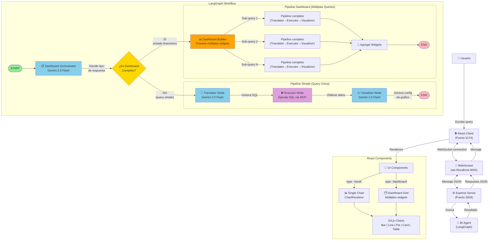
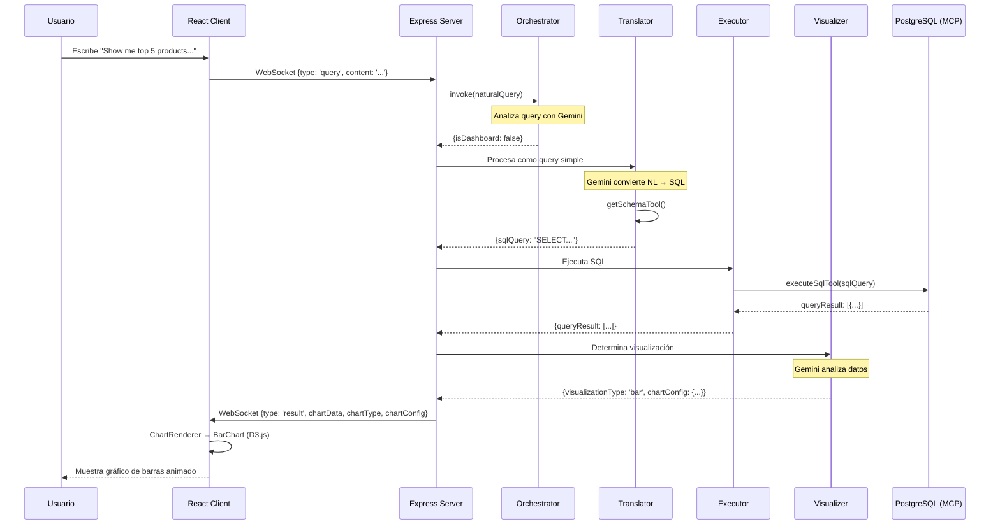
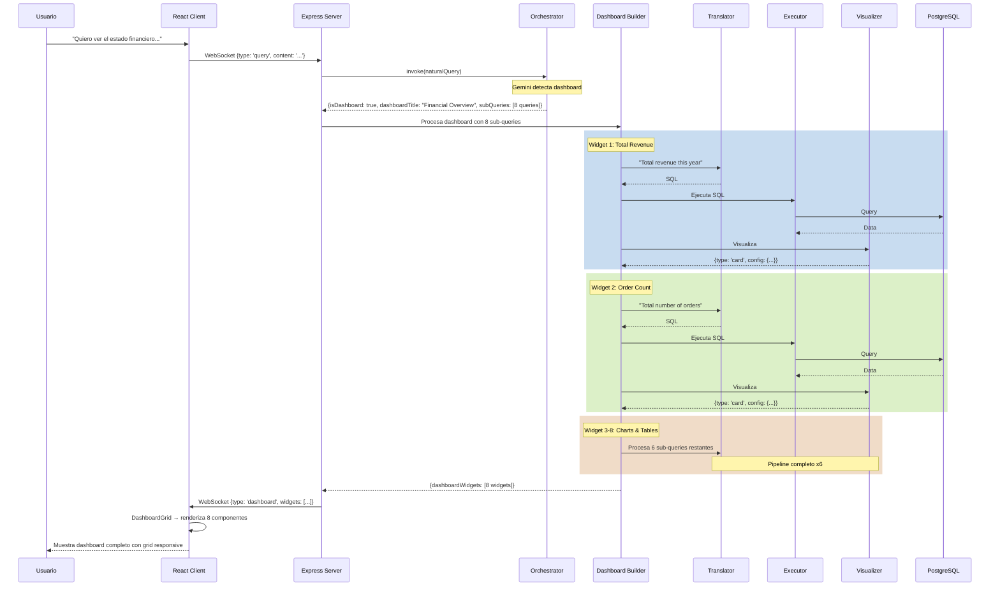

# Flujo Completo de Agentes - Data Copilot

## Diagrama de Arquitectura del Sistema



## Flujo Detallado por Tipo de Query

### 1️⃣ Query Simple: "Show me top 5 products by unit price"



### 2️⃣ Query Dashboard: "Quiero ver el estado financiero de mi empresa"



## Detalle de Componentes del Sistema

### 🤖 Agentes LangGraph

#### 1. Dashboard Orchestrator
**Función:** Punto de decisión inicial
- **Input:** `naturalQuery` del usuario
- **Proceso:** Usa Gemini 2.0 Flash para analizar la intención
- **Output:** 
  - `isDashboard: false` → Ruta a Translator
  - `isDashboard: true` + `subQueries[]` → Ruta a Dashboard Builder

#### 2. Translator Node
**Función:** Conversión NL → SQL
- **Input:** Query en lenguaje natural
- **Herramientas:** `getSchemaTool()` para contexto de la BD
- **LLM:** Gemini 2.0 Flash con temperatura 0.1
- **Output:** `sqlQuery` (string SQL válido)

#### 3. Executor Node
**Función:** Ejecución de SQL
- **Input:** `sqlQuery`
- **Herramientas:** `executeSqlTool()` vía MCP
- **MCP Server:** PostgreSQL Server (spawned child process)
- **Output:** `queryResult` (array de objetos)

#### 4. Visualizer Node
**Función:** Determina mejor tipo de gráfico
- **Input:** `queryResult` + `naturalQuery`
- **LLM:** Gemini 2.0 Flash con temperatura 0.2
- **Análisis:** Columnas, tipo de datos, cantidad de registros
- **Output:** 
  - `visualizationType`: 'bar' | 'line' | 'pie' | 'card' | 'table'
  - `chartConfig`: {xKey, yKey, label, etc.}

#### 5. Dashboard Builder
**Función:** Orquestador de múltiples widgets
- **Input:** Array de `subQueries`
- **Proceso:** 
  - Itera sobre cada sub-query
  - Ejecuta pipeline completo (T→E→V) para cada una
  - Agrega resultados a array de widgets
- **Output:** `dashboardWidgets[]`

### 🎨 Componentes React + D3.js

#### ChartRenderer
**Función:** Router de visualizaciones
- Recibe `type`, `data`, `config`
- Selecciona componente correcto
- Maneja estados de error y carga

#### Componentes D3.js
1. **BarChart** - Barras verticales con animación, labels en tope
2. **LineChart** - Línea con curva monotone, puntos animados
3. **PieChart** - Circular con leyenda, hover effects, porcentajes
4. **Card** - KPI grande con formato (currency, %, number)
5. **Table** - Tabla responsive con sorting (futuro)

#### DashboardGrid
**Función:** Layout responsive para múltiples widgets
- CSS Grid adaptativo (1-3 columnas)
- Borders con hover effects
- Títulos por widget

---

## Estados del Agente (AgentState)

```typescript
interface AgentState {
  // Siempre presentes
  messages: BaseMessage[];
  naturalQuery: string;
  
  // Query simple
  sqlQuery?: string;
  queryResult?: any[];
  visualizationType?: string;
  chartConfig?: any;
  error?: string;
  
  // Dashboard
  isDashboard?: boolean;
  dashboardTitle?: string;
  dashboardSubQueries?: {query: string, description: string}[];
  dashboardWidgets?: DashboardWidget[];
}
```

## Formato de Mensajes WebSocket

### Cliente → Servidor
```json
{
  "type": "query",
  "content": "Show me top 5 products by unit price"
}
```

### Servidor → Cliente (Query Simple)
```json
{
  "type": "result",
  "text": "This bar chart displays...",
  "chartData": [{...}],
  "chartType": "bar",
  "chartConfig": {"xKey": "product_name", "yKey": "unit_price"},
  "sql": "SELECT..."
}
```

### Servidor → Cliente (Dashboard)
```json
{
  "type": "dashboard",
  "text": "I've created a comprehensive Financial Overview...",
  "dashboardTitle": "Financial Overview",
  "widgets": [
    {
      "query": "Total revenue this year",
      "description": "Total Revenue",
      "data": [{...}],
      "chartType": "card",
      "chartConfig": {...}
    },
    // ... 7 widgets más
  ]
}
```

---

## Ejemplo Real: "Quiero ver el estado financiero de mi empresa"

### Sub-queries generadas por Orchestrator:
1. **"Total revenue this year"** → Card ($1,265,793.04)
2. **"Total number of orders"** → Card (830 orders)
3. **"Average order value"** → Card ($1,524.10)
4. **"Monthly revenue trend for the last 12 months"** → Line Chart
5. **"Sales by product category"** → Bar Chart (8 categorías)
6. **"Sales by country"** → Bar Chart (21 países)
7. **"Top 10 customers by total revenue"** → Table
8. **"Top 10 best-selling products"** → Table

### Layout del Dashboard:
```
┌─────────────┬─────────────┬─────────────┐
│  Card 1     │  Card 2     │  Card 3     │
│  Revenue    │  Orders     │  AOV        │
├─────────────┴─────────────┴─────────────┤
│  Line Chart - Revenue Trend (12 months)  │
├─────────────┬─────────────────────────────┤
│ Bar Chart   │  Bar Chart                  │
│ By Category │  By Country                 │
├─────────────┴─────────────────────────────┤
│  Table - Top 10 Customers                 │
├───────────────────────────────────────────┤
│  Table - Top 10 Products                  │
└───────────────────────────────────────────┘
```

