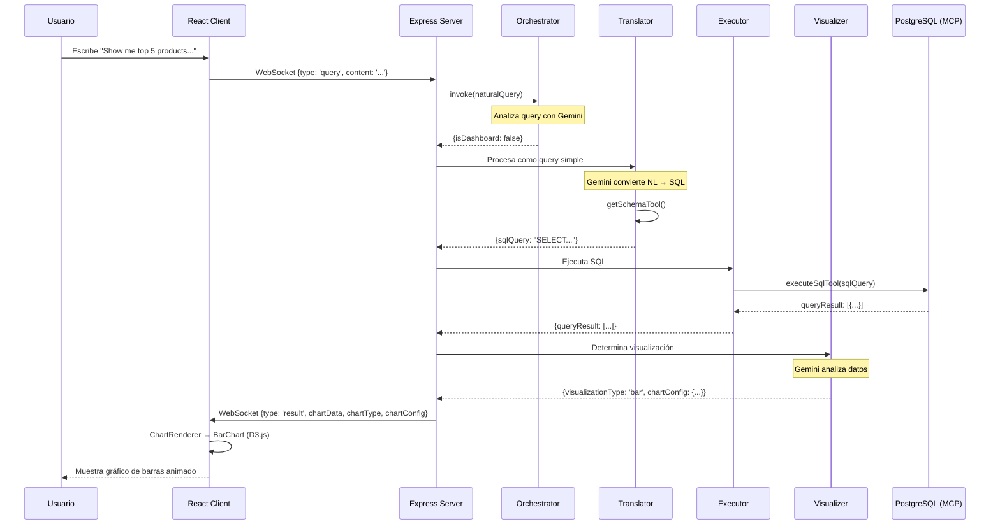
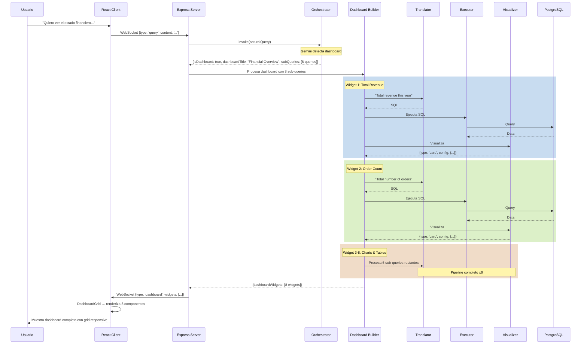

# Flujo Completo de Agentes - Data Copilot

## Diagrama de Arquitectura del Sistema

```mermaid
flowchart TB
    User["👤 Usuario"]
    Client["🌐 React Client<br/>(Puerto 5174)"]
    WS["🔌 WebSocket<br/>(ws://localhost:3004)"]
    Server["⚙️ Express Server<br/>(Puerto 3004)"]
    
    User -->|"Escribe query"| Client
    Client <-->|"WebSocket connection"| WS
    WS <-->|"Mensaje JSON"| Server
    
    Server -->|"Invoca"| BiAgent["🤖 BI Agent<br/>(LangGraph)"]
    
    subgraph "LangGraph Workflow"
        START(["START"])
        
        ContextValidator["🛡️ Context Validator<br/>Gemini 2.0 Flash<br/>Filtra queries fuera de contexto"]
        IntentClarifier["🔍 Intent Clarifier<br/>Gemini 2.0 Flash<br/>Enriquece contexto"]
        Orchestrator["📋 Dashboard Orchestrator<br/>Gemini 2.0 Flash"]
        
        START --> ContextValidator
        ContextValidator -->|"¿Es relevante?"| ValidCheck{"¿Sobre la<br/>base de datos?"}
        
        ValidCheck -->|"NO<br/>(historia, geografía, etc.)"| RejectQuery["❌ Rechazar Query<br/>Mensaje amigable"]
        ValidCheck -->|"SÍ<br/>(ventas, productos, etc.)"| IntentClarifier
        
        RejectQuery --> END_REJECT(["END"])
        
        IntentClarifier -->|"Enriquece query"| Orchestrator
        
        Orchestrator -->|"Decide tipo<br/>de respuesta"| Decision{"¿Es Dashboard<br/>Completo?"}
        
        Decision -->|"SÍ<br/>(estado financiero)"| DashboardBuilder["📊 Dashboard Builder<br/>Procesa múltiples widgets"]
        Decision -->|"NO<br/>(query simple)"| Translator["🔄 Translator Node<br/>Gemini 2.0 Flash"]
        
        subgraph "Pipeline Simple (Query Única)"
            Translator -->|"Genera SQL"| Executor["▶️ Executor Node<br/>Ejecuta SQL vía MCP"]
            Executor -->|"Obtiene datos"| Visualizer["📈 Visualizer Node<br/>Gemini 2.0 Flash"]
            Visualizer -->|"Genera config<br/>de gráfico"| END1(["END"])
        end
        
        subgraph "Pipeline Dashboard (Múltiples Queries)"
            DashboardBuilder -->|"Sub-query 1"| SubPipeline1["Pipeline completo<br/>(Translator→Executor→Visualizer)"]
            DashboardBuilder -->|"Sub-query 2"| SubPipeline2["Pipeline completo<br/>(Translator→Executor→Visualizer)"]
            DashboardBuilder -->|"Sub-query N"| SubPipelineN["Pipeline completo<br/>(Translator→Executor→Visualizer)"]
            
            SubPipeline1 --> Aggregate["🔗 Agregar Widgets"]
            SubPipeline2 --> Aggregate
            SubPipelineN --> Aggregate
            
            Aggregate --> END2(["END"])
        end
    end
    
    BiAgent -->|"Resultado"| Server
    Server -->|"Respuesta JSON"| WS
    WS -->|"Mensaje"| Client
    
    Client -->|"Renderiza"| UI["🎨 UI Components"]
    
    subgraph "React Components"
        UI -->|"type: 'result'"| SingleChart["📊 Single Chart<br/>ChartRenderer"]
        UI -->|"type: 'dashboard'"| DashboardGrid["🗂️ Dashboard Grid<br/>Múltiples widgets"]
        
        SingleChart --> D3Charts["D3.js Charts<br/>Bar | Line | Pie | Card | Table"]
        DashboardGrid --> D3Charts
    end
    
    style START fill:#90EE90
    style END1 fill:#FFB6C1
    style END2 fill:#FFB6C1
    style END_REJECT fill:#FF6B6B
    style ValidCheck fill:#FFD700
    style Decision fill:#FFD700
    style ContextValidator fill:#9370DB
    style IntentClarifier fill:#20B2AA
    style Orchestrator fill:#87CEEB
    style Translator fill:#87CEEB
    style Executor fill:#DDA0DD
    style Visualizer fill:#87CEEB
    style DashboardBuilder fill:#FFA500
    style RejectQuery fill:#FF6B6B
```



## Flujo Detallado por Tipo de Query

### 1️⃣ Query Simple: "Show me top 5 products by unit price"



### 2️⃣ Query Dashboard: "Quiero ver el estado financiero de mi empresa"



## Detalle de Componentes del Sistema

### 🤖 Agentes LangGraph

#### 0. Context Validator (NEW) 🛡️
**Función:** Filtro de seguridad para queries fuera de contexto
- **Input:** `naturalQuery` del usuario
- **Proceso:** Usa Gemini 2.0 Flash (temp: 0.1) para validar relevancia
- **Validaciones:**
  - ✅ **ACEPTA:** Consultas sobre ventas, productos, clientes, empleados, métricas de negocio, saludos
  - ❌ **RECHAZA:** Historia, geografía, cultura general, ciencia, cocina, eventos actuales, temas no relacionados
- **Output:** 
  - Si es válida → Continúa al Intent Clarifier
  - Si NO es válida → Retorna error con mensaje amigable y termina flujo
- **Ejemplos rechazados:**
  - "¿Quién descubrió América?" → "Lo siento, solo puedo ayudarte con consultas sobre la base de datos..."
  - "¿Cuál es la capital de Francia?" → Rechazada
  - "Explícame física cuántica" → Rechazada

#### 1. Intent Clarifier 🔍
**Función:** Enriquecimiento de contexto y detección de ambigüedades
- **Input:** `naturalQuery` validada
- **Proceso:** Usa Gemini 2.0 Flash (temp: 0.3) para analizar dimensiones faltantes
- **Análisis:**
  - Dimensión temporal (¿qué período? → all time, 1997, 1998)
  - Dimensión geográfica (¿qué región? → todas, específica)
  - Dimensión categórica (¿qué productos/categorías?)
  - Nivel de agregación (top N, total, promedio, tendencia)
  - Métrica de ordenamiento (revenue, quantity, price)
- **Output:** 
  - `queryIntent`: { isAmbiguous, missingDimensions, enrichedQuery, assumptions }
  - `naturalQuery`: Query enriquecida con contexto completo
- **Ejemplo:**
  - Input: "Top 5 productos"
  - Output enriched: "Top 5 products by total revenue (all time, all categories)"

#### 2. Dashboard Orchestrator
**Función:** Punto de decisión de tipo de respuesta
- **Input:** `naturalQuery` enriquecida + `queryIntent`
- **Proceso:** Usa Gemini 2.0 Flash (temp: 0.3) para detectar si requiere dashboard completo
- **Output:** 
  - `isDashboard: false` → Ruta a Translator (query simple)
  - `isDashboard: true` + `subQueries[]` → Ruta a Dashboard Builder (múltiples widgets)

#### 3. Translator Node
**Función:** Conversión NL → SQL
- **Input:** Query en lenguaje natural enriquecida + `queryIntent`
- **Herramientas:** `getSchemaTool()` para contexto de la BD
- **LLM:** Gemini 2.0 Flash con temperatura 0
- **Reglas críticas:**
  - ❌ NUNCA inventar columnas que no existen en el schema
  - ✅ Solo usar sintaxis PostgreSQL válida (DATE_TRUNC, EXTRACT, etc.)
  - ⏰ Base de datos histórica (1996-1998): NO usar CURRENT_DATE o NOW()
  - 🎯 Validar que TODAS las columnas existen antes de generar SQL
- **Output:** `sqlQuery` (string SQL válido)
- **Ejemplo SQL generado:**
  ```sql
  SELECT p.product_name, SUM(od.quantity) as total_sold
  FROM products p
  JOIN order_details od ON p.product_id = od.product_id
  WHERE EXTRACT(YEAR FROM od.order_date) = 1997
  GROUP BY p.product_id, p.product_name
  ORDER BY total_sold DESC
  LIMIT 5;
  ```

#### 4. Executor Node
**Función:** Ejecución de SQL
- **Input:** `sqlQuery`
- **Herramientas:** `executeSqlTool()` vía MCP
- **MCP Server:** PostgreSQL Server (spawned child process)
- **MCP Tools disponibles:**
  - `execute_query`: Ejecuta SQL SELECT
  - `get_schema`: Obtiene esquema completo de la BD
  - `get_tables_list`: Lista nombres de tablas
  - `get_table_columns`: Obtiene columnas de una tabla específica (NEW)
  - `get_selected_tables_schema`: Schema selectivo de tablas
  - `describe_table`: Descripción detallada de una tabla
- **Output:** `queryResult` (array de objetos)
- **Logging:** Muestra número de filas retornadas y errores SQL

#### 5. Visualizer Node
**Función:** Determina mejor tipo de gráfico
- **Input:** `queryResult` + `naturalQuery`
- **LLM:** Gemini 2.0 Flash con temperatura 0.2
- **Análisis:** Columnas, tipo de datos, cantidad de registros
- **Output:** 
  - `visualizationType`: 'bar' | 'line' | 'pie' | 'card' | 'table'
  - `chartConfig`: {xKey, yKey, label, etc.}
- **Fallback:** Si falla parsing, default a 'table'

#### 6. Dashboard Builder
**Función:** Orquestador de múltiples widgets
- **Input:** Array de `subQueries`
- **Proceso:** 
  - Itera sobre cada sub-query
  - Ejecuta pipeline completo (T→E→V) para cada una
  - Agrega resultados a array de widgets
- **Output:** `dashboardWidgets[]`

### 🎨 Componentes React + D3.js

#### ChartRenderer
**Función:** Router de visualizaciones
- Recibe `type`, `data`, `config`
- Selecciona componente correcto
- Maneja estados de error y carga

#### Componentes D3.js
1. **BarChart** - Barras verticales con animación, labels en tope
2. **LineChart** - Línea con curva monotone, puntos animados
3. **PieChart** - Circular con leyenda, hover effects, porcentajes
4. **Card** - KPI grande con formato (currency, %, number)
5. **Table** - Tabla responsive con sorting (futuro)

#### DashboardGrid
**Función:** Layout responsive para múltiples widgets
- CSS Grid adaptativo (1-3 columnas)
- Borders con hover effects
- Títulos por widget

---

## Estados del Agente (AgentState)

```typescript
interface AgentState {
  // Siempre presentes
  messages: BaseMessage[];
  naturalQuery: string;
  
  // Intent analysis (NEW)
  queryIntent?: {
    isAmbiguous: boolean;
    missingDimensions?: string[];
    internalQuestions?: string[];
    originalQuery: string;
    enrichedQuery: string;
    assumptions?: {
      timePeriod?: string;
      region?: string;
      metric?: string;
      limit?: number;
      groupBy?: string[];
      orderBy?: string;
      filters?: string[];
    };
    contextEnrichment?: string;
  };
  
  // Query simple
  sqlQuery?: string;
  queryResult?: any[];
  visualizationType?: string;
  chartConfig?: any;
  error?: string;
  
  // Dashboard
  isDashboard?: boolean;
  dashboardTitle?: string;
  dashboardSubQueries?: {query: string, description: string}[];
  dashboardWidgets?: DashboardWidget[];
}
```

## Formato de Mensajes WebSocket

### Cliente → Servidor
```json
{
  "type": "query",
  "content": "Show me top 5 products by unit price"
}
```

### Servidor → Cliente (Query Simple)
```json
{
  "type": "result",
  "text": "This bar chart displays...",
  "chartData": [{...}],
  "chartType": "bar",
  "chartConfig": {"xKey": "product_name", "yKey": "unit_price"},
  "sql": "SELECT...",
  "queryIntent": {
    "isAmbiguous": true,
    "missingDimensions": ["temporal", "metric"],
    "originalQuery": "Top 5 productos",
    "enrichedQuery": "Top 5 products by total revenue (all time)",
    "assumptions": {
      "timePeriod": "all time",
      "metric": "revenue",
      "limit": 5
    }
  }
}
```

### Servidor → Cliente (Query Rechazada)
```json
{
  "type": "error",
  "text": "Lo siento, solo puedo ayudarte con consultas sobre la base de datos de ventas, productos, clientes y empleados. Por ejemplo: 'Top 5 productos', 'Ventas por región', 'Empleados por país'.",
  "error": "OUT_OF_CONTEXT"
}
```

### Servidor → Cliente (Dashboard)
```json
{
  "type": "dashboard",
  "text": "I've created a comprehensive Financial Overview...",
  "dashboardTitle": "Financial Overview",
  "widgets": [
    {
      "query": "Total revenue this year",
      "description": "Total Revenue",
      "data": [{...}],
      "chartType": "card",
      "chartConfig": {...}
    },
    // ... 7 widgets más
  ]
}
```

---

## Validación de Contexto - Ejemplos

### ❌ Queries Rechazadas (Fuera de Contexto)

| Query del Usuario | Categoría | Respuesta del Sistema |
|-------------------|-----------|----------------------|
| "¿Quién descubrió América?" | Historia | "Lo siento, solo puedo ayudarte con consultas sobre la base de datos..." |
| "¿Cuál es la capital de Francia?" | Geografía | Rechazada con mensaje amigable |
| "¿Cómo se hace una pizza?" | Cocina | Rechazada |
| "Explícame la teoría de la relatividad" | Ciencia | Rechazada |
| "¿Qué tiempo hace hoy?" | Clima | Rechazada |
| "¿Cuánto es 5 + 5?" | Matemáticas | Rechazada (no relacionado con datos) |

### ✅ Queries Aceptadas (Contexto Válido)

| Query del Usuario | Categoría | Procesamiento |
|-------------------|-----------|---------------|
| "Top 5 productos" | Negocio | Procesada → SQL generado |
| "Ventas por región" | Análisis | Procesada → Dashboard o gráfico |
| "Hola" | Saludo | Aceptada → Respuesta conversacional |
| "Gracias" | Cortesía | Aceptada → "¡De nada!" |
| "¿Qué datos tienes?" | Sistema | Aceptada → Explica tablas disponibles |
| "Empleados por país" | Negocio | Procesada → SQL generado |

---

## Ejemplo Real: "Quiero ver el estado financiero de mi empresa"

### Flujo Completo:

**1. Context Validator:**
- ✅ Query válida (relacionada con análisis financiero de negocio)
- Continúa al Intent Clarifier

**2. Intent Clarifier:**
- Detecta ambigüedad: falta período temporal, métricas específicas
- Enriquece: "Complete financial overview dashboard with revenue, orders, trends, and breakdowns for all time (using historical data 1996-1998)"
- Assumptions: timePeriod: "all time", includeKPIs: true, includeTrends: true

**3. Orchestrator:**
- Detecta: isDashboard = true
- Genera 8 sub-queries:

### Sub-queries generadas por Orchestrator:
1. **"Total revenue from all orders"** → Card ($1,265,793.04)
2. **"Total number of orders"** → Card (830 orders)
3. **"Average order value"** → Card ($1,524.10)
4. **"Monthly order trend for 1997"** → Line Chart (12 puntos)
5. **"Revenue by product category"** → Bar Chart (8 categorías)
6. **"Orders by customer country"** → Bar Chart (21 países)
7. **"Top 10 customers by total spent"** → Table
8. **"Top 10 best-selling products by quantity"** → Table

### Layout del Dashboard:
```
┌─────────────┬─────────────┬─────────────┐
│  Card 1     │  Card 2     │  Card 3     │
│  Revenue    │  Orders     │  AOV        │
├─────────────┴─────────────┴─────────────┤
│  Line Chart - Revenue Trend (12 months)  │
├─────────────┬─────────────────────────────┤
│ Bar Chart   │  Bar Chart                  │
│ By Category │  By Country                 │
├─────────────┴─────────────────────────────┤
│  Table - Top 10 Customers                 │
├───────────────────────────────────────────┤
│  Table - Top 10 Products                  │
└───────────────────────────────────────────┘
```

